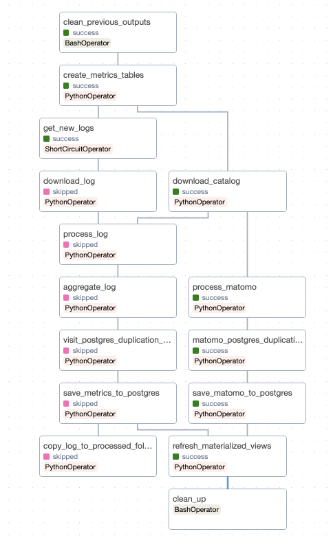

# Documentation

## metrics

| Information | Valeur |
| -------- | -------- |
| Fichier source     | `dag.py`     |
| Description | Aggrège les visites par jour et par organisation, dataset, resource, etc. les logs HAProxy générés par udata. |
| Fréquence de mise à jour | Quotidienne |
| Données sources | Données issues de l'infrastructure de data.gouv.fr. |
| Données de sorties | Tables Postgres. |
| Channel Mattermost d'information | ~startup-datagouv-dataeng |

## DAG

